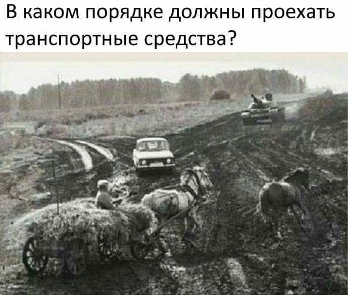

# pdd_russia



[](https://yoomoney.ru/to/41001287467423)

Описание:

Репозиторий содержит экзаменационные вопросы для получения водительского удостоверения в РФ, доп.материалы по
дорожным знакам, а так же краткую информацию по штрафам за правонарушения.
Вопросы сгруппированы по билетам от 1 до 40, раздел ПДД, а так же по разделам правил.
Стоит учесть, что не все вопросы из разделов могут встретиться в билетах.
Ещё одним нюансом является то, что один и тот же вопрос может встречаться в разных разделах / разных категориях.

* A_B / C_D - категории прав
* tickets - непосредственно экзаменационные билеты.
* topic - вопросы, сгруппированные по разделам.
* в папке images/ находятся сопутствующие графические материалы.
* no_image.jpg добавьте по вкусу.

Несколько замечаний:

* topic стал массивом.
* id - Digest::MD5.hexdigest("#{result['question']}-#{result['answers'].map(&:values).join}" .
* ticket_number правомерен только для билетов.
* В некоторых случаях один и тот же вопрос может иметь разные графические материалы.

```json
  {
    "title": "Вопрос 1",
    "ticket_number": "Билет 2",
    "ticket_category": "A,B",
    "image": "./images/A_B/1871b903ddd6b18d2bc45133234dd7fa.jpg",
    "question": "Сколько полос для движения имеет данная дорога?",
    "answers": [
      {
        "answer_text": "Две",
        "is_correct": false
      },
      {
        "answer_text": "Четыре",
        "is_correct": true
      },
      {
        "answer_text": "Пять",
        "is_correct": false
      }
    ],
    "correct_answer": "Правильный ответ: 2",
    "answer_tip": "Разделительная полоса делит дорогу на проезжие части. Данная дорога имеет две проезжие части, четыре полосы движения.(Пункт 1.2 ПДД)",
    "topic": [
      "Общие положения"
    ],
    "id": "40edd1d720133385413d2302583b2eee"
  }
```

Кратко о дорожных знаках:

Все данные по знакам содержатся в signs/signs.json, сопутствующие графические материалы в images/signs.
Верхнеуровневыми ключами являются категории знаков: "Предупреждающие знаки", "Знаки приоритета" и тд.

```json
{
  "Предупреждающие знаки": {
    "1.1": {
      "number": "1.1",
      "title": "Железнодорожный переезд со шлагбаумом",
      "image": "./images/signs/1_1.gif",
      "description": null
    },
    "1.3.2": {
      "number": "1.3.2",
      "title": "Многопутная железная дорога",
      "image": "./images/signs/1_3_2.gif",
      "description": "Обозначение необорудованного шлагбаумом переезда через железную дорогу: 1.3.1 - с одним путем 1.3.2 - с двумя путями и более"
    }
  }
}
```

Немного о штрафах:

Данные по штрафам (КоАП), наказаниям по статьям УК РФ содержатся в penalties/penalties.json
Статью УК от КоАП отличает наличие УК РФ в в ключе article_part.

```json
{
  "article_part": "12.8 ч. 3",
  "text": "Управление ТС водителем, находящимся в состоянии опьянения и не имеющим права управления ТС либо лишенным права управления ТС",
  "penalty": "арест на срок от 10 до 15 суток или штраф 30000 руб. для лиц, в отношении которых не может применяться арест"
}
{
  "article_part": "264.1 УК РФ",
  "text": "Управление автомобилем, трамваем либо другим механическим транспортным средством лицом, находящимся в состоянии опьянения, подвергнутым административному наказанию за управление транспортным средством в состоянии опьянения или за невыполнение законного требования уполномоченного должностного лица о прохождении медицинского освидетельствования на состояние опьянения",
  "penalty": "штраф от 200 000 до 300 000 руб., либо обязательные работы (до 480 часов), либо принудительные работы (до 2 лет), либо лишение свободы (до 2 лет)"
}
```

Чуть-чуть о дорожной разметке:

Информация по разметке содержится в markup/markup.json
```json
{
  "Горизонтальная разметка": {
    "1.1": {
      "number": "1.1",
      "image": "./images/markup/2c49fc36554ac1230451d3dcfa2eed8a.svg",
      "description": "Разделяет транспортные потоки противоположных направлений и обозначает границы полос движения вопасных местах надорогах; обозначает границы стояночных мест транспортных средств; Нумерация разметки соответствует ГОСТу Р 51256-2018. Запрещается пересекать."
    },
    "1.2": {
      "number": "1.2",
      "image": "./images/markup/7ec9fc4bbba7de96b98c40a318c133ed.svg",
      "description": "Обозначает край проезжей части или границы участков проезжей части, накоторые въезд запрещен. Допускается пересекать для остановки транспортного средства на обочине и при выезде с нее в местах, где разрешена остановка или стоянка."
    }
  },
  "Вертикальная разметка": {
    "2.1": {
      "number": "2.1",
      "image": "./images/markup/11115b65ace8dd9993eb21404d283d95.svg",
      "description": "Обозначают элементы дорожных сооружений (опор мостов, путепроводов, торцовых частей парапетов и тому подобного), когда эти элементы представляют опасность для движущихся транспортных средств."
    }
  }  
}
```